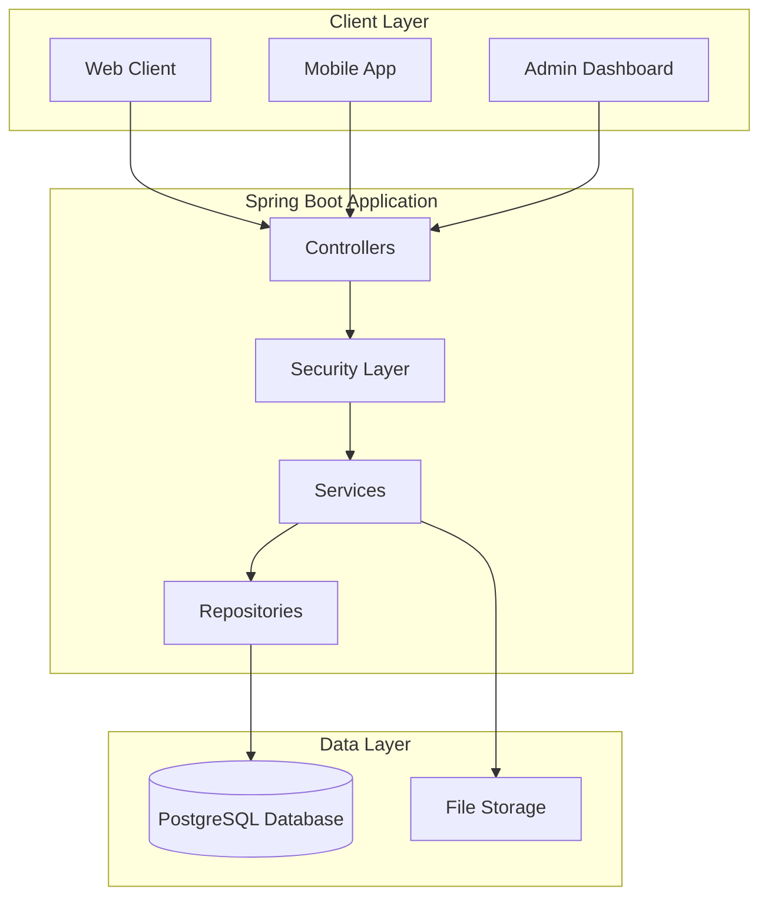

# ASOIU Conference Portal

A comprehensive Spring Boot application for managing academic conferences, including paper submissions, peer reviews, and session management.

## Features

- **User Management**: Registration, authentication, and role-based access control
- **Paper Submission**: Authors can submit papers with metadata and file uploads
- **Peer Review System**: Committee members can review and evaluate submissions
- **Session Management**: Organize accepted papers into conference sessions
- **Multi-role Support**: AUTHORS, COMMITTEE members, and ADMIN users
- **JWT Authentication**: Stateless security with role-based authorization
- **File Handling**: Manuscript uploads with validation and storage

## Technology Stack

- **Backend**: Spring Boot 3.x, Spring Security, Spring Data JPA
- **Database**: PostgreSQL (MySQL compatible)
- **Authentication**: JWT tokens with role-based access control
- **Build Tool**: Gradle with Wrapper
- **Java Version**: 17+

*Interactive API documentation showing the paper-controller and user-controller endpoints. The application includes integrated Swagger/OpenAPI 3.0 documentation accessible at `http://localhost:8080/swagger-ui.html` when running.*

## Project Structure

```
asoiu-conference-portal/
├─ build.gradle
├─ settings.gradle
├─ gradlew
├─ gradlew.bat
├─ gradle/
│  └─ wrapper/
│     ├─ gradle-wrapper.jar
│     └─ gradle-wrapper.properties
└─ src/
   ├─ main/
   │  ├─ java/
   │  │  └─ (Spring Boot application root)
   │  │     ├─ config/           # Security, web, application config
   │  │     ├─ controller/       # REST controllers
   │  │     ├─ service/          # Business logic services
   │  │     ├─ repository/       # Spring Data JPA repositories
   │  │     ├─ entity/           # JPA/Hibernate entities
   │  │     ├─ dto/              # Request/response DTOs
   │  │     ├─ mapper/           # DTO↔entity mapping
   │  │     └─ exception/        # Global handlers, custom exceptions
   │  └─ resources/
   │     ├─ application.yml      # Environment configuration
   │     └─ db/migration/        # Database migration scripts
   └─ test/
      └─ java/                   # JUnit 5 tests
```

## Installation & Setup

### Prerequisites

- Java 17 or higher
- PostgreSQL or MySQL database
- Git

### 1. Clone the Repository

```bash
git clone https://github.com/aliagasiyev/asoiu-conference-portal.git
cd asoiu-conference-portal
```

### 2. Database Configuration

Create a PostgreSQL database and update `src/main/resources/application.yml`:

```yaml
server:
  port: 8080

spring:
  datasource:
    url: jdbc:postgresql://localhost:5432/asoiu_conf
    username: your_username
    password: your_password
    driver-class-name: org.postgresql.Driver
  
  jpa:
    hibernate:
      ddl-auto: update
    properties:
      hibernate:
        dialect: org.hibernate.dialect.PostgreSQLDialect
        format_sql: true
    show-sql: false

app:
  security:
    jwt:
      secret: your-256-bit-secret-key-here
      expirationMinutes: 1440
```

For MySQL, use:
```yaml
spring:
  datasource:
    url: jdbc:mysql://localhost:3306/asoiu_conf
    driver-class-name: com.mysql.cj.jdbc.Driver
  jpa:
    properties:
      hibernate:
        dialect: org.hibernate.dialect.MySQLDialect
```

### 3. Run the Application

#### Development Mode
```bash
./gradlew clean bootRun
```

#### Production Build
```bash
./gradlew clean build
java -jar build/libs/asoiu-conference-portal-*.jar
```

The application will start on `http://localhost:8080`

## API Documentation

### Interactive Documentation

The application includes **Swagger/OpenAPI 3.0** integration for interactive API documentation. Once the application is running, you can access:

- **Swagger UI**: `http://localhost:8080/swagger-ui.html`
- **OpenAPI JSON**: `http://localhost:8080/v3/api-docs`

The Swagger interface provides:
- Complete endpoint documentation
- Request/response schemas
- Interactive API testing
- Authentication support
- Real-time API exploration

### Authentication Endpoints

| Method | Endpoint | Description | Access |
|--------|----------|-------------|---------|
| POST | `/api/auth/register` | Register new user | Public |
| POST | `/api/auth/login` | User login | Public |
| POST | `/api/auth/refresh` | Refresh JWT token | Authenticated |
| GET | `/api/auth/me` | Get current user profile | Authenticated |

### User Management

| Method | Endpoint | Description | Access |
|--------|----------|-------------|---------|
| GET | `/api/users/me` | Get own profile | Authenticated |
| PUT | `/api/users/me` | Update own profile | Authenticated |
| GET | `/api/admin/users` | List all users | Admin |
| PATCH | `/api/admin/users/{id}/roles` | Update user roles | Admin |

### Paper Management

| Method | Endpoint | Description | Access |
|--------|----------|-------------|---------|
| GET | `/api/papers` | List papers (with filters) | Authenticated |
| POST | `/api/papers` | Submit new paper | Author |
| GET | `/api/papers/{id}` | Get paper details | Authenticated |
| PUT | `/api/papers/{id}` | Update paper metadata | Author/Admin |
| DELETE | `/api/papers/{id}` | Withdraw paper | Author/Admin |
| POST | `/api/papers/{id}/coauthors` | Add co-author | Author |
| DELETE | `/api/papers/{id}/coauthors/{coAuthorId}` | Remove co-author | Author |
| POST | `/api/papers/{id}/files` | Upload manuscript | Author |

### Review System

| Method | Endpoint | Description | Access |
|--------|----------|-------------|---------|
| GET | `/api/reviews` | List reviews | Committee/Admin |
| POST | `/api/reviews` | Submit review | Assigned Reviewer |
| PUT | `/api/reviews/{id}` | Update review | Reviewer |
| POST | `/api/papers/{id}/assignments` | Assign reviewers | Committee/Admin |
| POST | `/api/papers/{id}/decision` | Record final decision | Committee/Admin |

### Session & Topic Management

| Method | Endpoint | Description | Access |
|--------|----------|-------------|---------|
| GET | `/api/sessions` | List sessions | Authenticated |
| POST | `/api/sessions` | Create session | Admin |
| PUT | `/api/sessions/{id}` | Update session | Admin |
| DELETE | `/api/sessions/{id}` | Delete session | Admin |
| GET | `/api/topics` | List topics | Authenticated |
| POST | `/api/topics` | Create topic | Admin |

## User Roles

- **AUTHOR**: Can submit papers, view own submissions, respond to reviews
- **COMMITTEE**: Can review assigned papers, view all submissions, make decisions
- **ADMIN**: Full system access, user management, system configuration

## Authentication

The API uses JWT (JSON Web Tokens) for authentication. Include the token in the Authorization header:

```
Authorization: Bearer <your-jwt-token>
```

## Architecture



## Design Patterns Used

- **Layered Architecture**: Clear separation of concerns across controller, service, and repository layers
- **Repository Pattern**: Data access abstraction using Spring Data JPA
- **DTO Pattern**: Request/response objects separate from domain entities
- **Dependency Injection**: Spring's IoC container manages component lifecycle
- **JWT Token-based Authentication**: Stateless authentication mechanism
- **Role-based Access Control (RBAC)**: Method-level security annotations

## Testing

Run the test suite:

```bash
./gradlew test
```

Generate test coverage report:

```bash
./gradlew jacocoTestReport
```

## Configuration Profiles

The application supports different profiles:

- `dev`: Development configuration with detailed logging
- `prod`: Production configuration with optimized settings
- `test`: Testing configuration with H2 in-memory database

Activate a profile:

```bash
java -jar app.jar --spring.profiles.active=prod
```

## Contributing

1. Fork the repository
2. Create a feature branch (`git checkout -b feature/amazing-feature`)
3. Commit your changes (`git commit -m 'Add some amazing feature'`)
4. Push to the branch (`git push origin feature/amazing-feature`)
5. Open a Pull Request

## Future Enhancements

- **Email Notifications**: Automated notifications for submissions, assignments, and decisions
- **File Security**: Antivirus scanning and enhanced file validation
- **CI/CD Pipeline**: Automated testing and deployment
- **Docker Support**: Containerization for easy deployment
- **Caching Layer**: Redis integration for improved performance
- **API Rate Limiting**: Protection against abuse
- **Admin Dashboard**: Web interface for system administration
- **Mobile API**: Enhanced mobile application support

## Security Considerations

- JWT tokens are stateless and include expiration times
- Password hashing using BCrypt
- SQL injection prevention through parameterized queries
- CORS configuration for cross-origin requests
- Input validation on all endpoints
- Role-based access control at method level

## License

This project is open source. Please add a LICENSE file to specify the terms of use.

## Contact & Support

- **Repository**: [github.com/aliagasiyev/asoiu-conference-portal](https://github.com/aliagasiyev/asoiu-conference-portal)
- **Issues**: Report bugs and feature requests via GitHub Issues
- **Developer**: [@aliagasiyev](https://github.com/aliagasiyev)

## Acknowledgments

- Spring Boot community for excellent documentation
- ASOIU for supporting this open-source initiative
- Contributors and testers who helped improve this project
